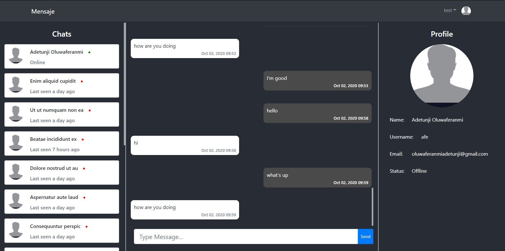

[](https://travis-ci.com/oluwaferanmiadetunji/messaging-application-backend)

<br />
<p align="center">
  <a href="https://voteright-e8208.firebaseapp.com">
    
  </a>

  <h3 align="center">Messanger</h3>

  <p align="center">
    A real time messaging app
    <br />
    <br />
    <a href="https://mensaje.netlify.app/">View Demo</a>
    ·
    <a href=" https://github.com/oluwaferanmiadetunji/messaging-application-frontend.git/issues">Report Bug</a>
    ·
    <a href=" https://github.com/oluwaferanmiadetunji/messaging-application-frontend.git/issues">Request Feature</a>
  </p>
</p>

# messaging-application-frontend

### Front end code for a realtime messaging application

<!-- TABLE OF CONTENTS -->

## Table of Contents

-   [About the Project](#about-the-project)
    -   [Built With](#built-with)
-   [Getting Started](#getting-started)
    -   [Installation](#installation)
    -   [Starting](#starting)
    -   [Starting](#starting)
-   [Contributing](#contributing)
-   [License](#license)
-   [Contact](#contact)

<!-- ABOUT THE PROJECT -->

## About The Project

Messenger is a real time messaging web app. Users are able to share real time data with each other

### Built With

-   [React](https://reactjs.org/)
-   [React Bootstrap](https://react-bootstrap.netlify.app/getting-started/introduction/)
-   [Node.js](https://nodejs.org/en/)
-   [socket.io](https://socket.io/)

<!-- GETTING STARTED -->

## Getting Started

To get a local copy up and running follow these simple steps.

### Installation

1. Clone the repo

```sh
git clone https://github.com/oluwaferanmiadetunji/messaging-application-frontend.git
```

2. Install NPM packages

```sh
npm run install
```

### Starting

```sh
npm run start
```

You will then be able to access it at localhost:3000

### Wireframe

https://www.figma.com/file/OGwK27pUee818dc83ZEu9c/Messanger-Wireframe?node-id=4%3A0

<!-- CONTRIBUTING -->

## Contributing

<!--
Contributions are what make the open source community such an amazing place to be learn, inspire, and create. Any contributions you make are **greatly appreciated**.
-->

1. Fork the Project
2. Create your Feature Branch (`git checkout -b feature/name/AmazingFeature`)
3. Commit your Changes (`git commit -m 'Add some AmazingFeature`)
4. Push to the Branch (`git push origin feature/AmazingFeature`)
5. Open a Pull Request

<!-- LICENSE -->

## License

Distributed under the MIT License. See `LICENSE` for more information.

<!-- CONTACT -->

## Contact

Adetunji Oluwaferanmi - oluwaferanmiadetunji@gmail.com
